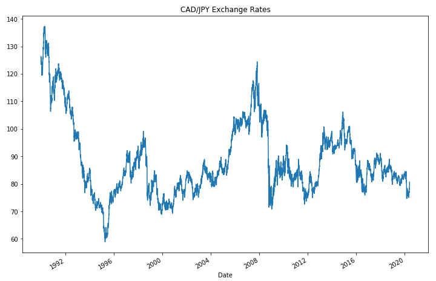
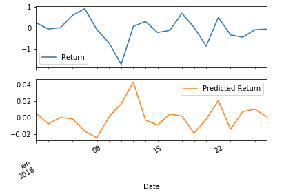

# Time-Series-Homework

## Time-Series Forecasting
In the time_series_analysis notebook, historical CAD-JPY exchange rate data was loaded and time series analysis and modelling was applied to determine if there is any predictable behaviour.

Based on the plot above, we can see a long-term weakening of the Japanese Yen respective to the Canadian Dollar. There do seem to be some more medium, 1-3 year consistent trends, but on a daily basis, there are a lot of short-term ups and downs.

### Decomposition using a Hodrick-Prescott filter

Smoothing with the HP Filter and plotting the resulting trend against the actual futures returns, we can see that there's a lot of short term fluctuations that deviate around this trend. Perhaps these would represent profitable trading opportunities: For example, when the blue line deviates far below the orange, we can see this as a sign that the Yen is temporarily more undervalued than it should be (and, therefore, we'd see this as a short-term buying opportunity).

### Forecasting returns using an ARMA model

Based on the p-value, the model is not a good fit because of the second lag taken into account. The p-value for AR2 is very high. If the same model was run with the order (1,1) the results would be better.

### Forecasting the exchange rate price using an ARIMA model

The forecast indicates a fall in the value of the Japanese Yen in the coming days.

### Forecasting volatility with GARCH

Based on the graph above, the forecast for CAD/JPY volatility is that it is expected to rise over the next 5 days.

## Linear Regression Forecasting

In the regression_analysis notebook, a Scikit-Learn linear regression model is built to predict CAD/JPY returns with *lagged* CAD/JPY futures returns and categorical calendar seasonal effects (e.g., day-of-week or week-of-year seasonal effects).

The model surprisingly performs better on the testing data than on the training data.